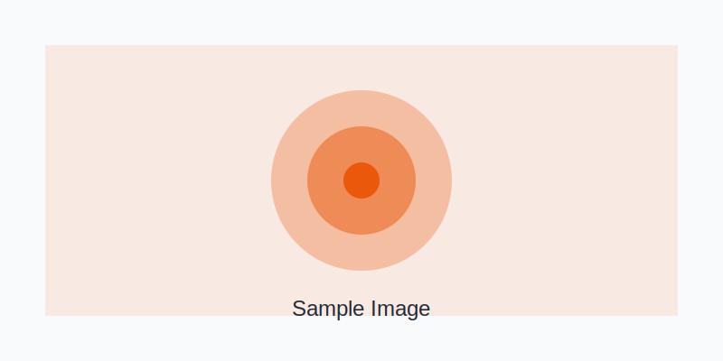
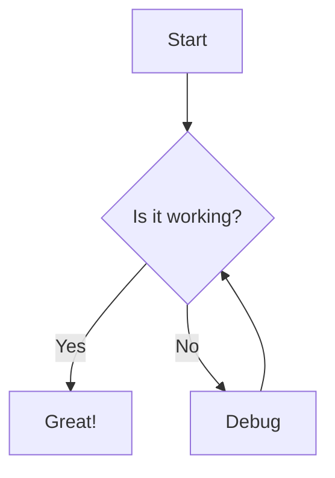
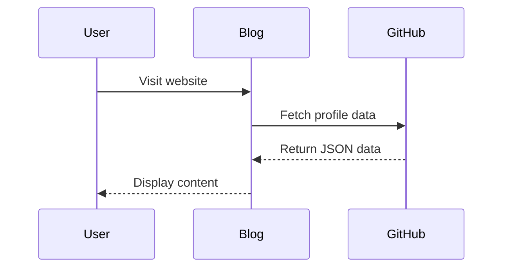

Welcome to my personal blog! This is the first post, and I'm excited to share my thoughts, ideas, and projects with you.

<!-- truncate -->

## About This Blog

This blog is built using [Docusaurus](https://docusaurus.io), a powerful static site generator that makes it easy to maintain and deploy a blog. The design is inspired by Dieter Rams' minimalist philosophy and Braun's iconic aesthetic.

## Features

This blog supports:

- **Markdown rendering** with GitHub-flavored syntax
- **Relative images** that work seamlessly
- **Mermaid diagrams** for visualizing complex ideas
- **Clean, minimalist design** focused on readability

## Sample Image

Here's a sample image (relative reference):



## Code Examples

The blog also supports syntax highlighting for code blocks:

```typescript
function greet(name: string): string {
  return `Hello, ${name}!`;
}

console.log(greet('World'));
```

```python
def fibonacci(n):
    if n <= 1:
        return n
    return fibonacci(n-1) + fibonacci(n-2)

print(fibonacci(10))
```

## Mermaid Diagrams

You can also include Mermaid diagrams in your posts:



Here's a more complex example:



## Getting Started

To add a new blog post:

1. Create a new folder in the `blog` directory
2. Add your markdown file and any images to that folder
3. Reference images using relative paths like `./img/image.png`
4. Deploy!

## What's Next

I'll be sharing posts about:
- Software development
- Design and architecture
- Tools and workflows
- Personal projects

Stay tuned!

---

*This blog is still a work in progress. Feel free to check back soon for more content!*


