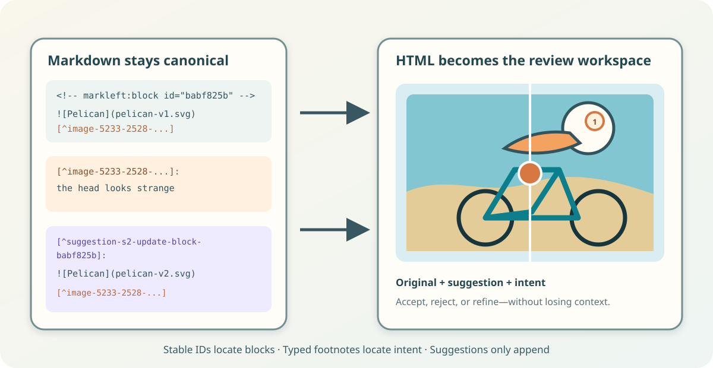

<!-- markleft:block id="bbdef46b" -->
# Markleft: How I review plans in Markdown

<!-- markleft:block id="b25542a4" -->
AI output seldom meets the intent on the first prompt, so iteration is necessary. Today, iteration usually means providing feedback in a follow-up prompt, which leads to a rewrite of the whole document. The prompt that explains the intent behind the revision remains buried in the chat.

<!-- markleft:block id="b25542a4" -->
Imagine sending a colleague a five page document. They read it and have some concerns. The workflow would **not** be:

<!-- markleft:block id="b6db3e2b" -->
> - Email me a prose description of everything you dislike
> - I send you a completely rewritten document
> - Then compare the two files and figure out whether I understood you

<!-- markleft:block id="bfbc84d1" -->
That is absurd—this workflow has been solved for decades by comments and tracked changes in Word, or by Suggesting mode in Google Docs.

<!-- markleft:block id="bbde9bf5" -->


<!-- markleft:block id="bf83a612" -->
Want to see it in action? [spoiler](#see-it-in-action)

<!-- markleft:block id="bf03f413" -->
\<!-- truncate -->

<!-- markleft:block id="b6b63375" -->
## Working with AI in Markdown and where it breaks

<!-- markleft:block id="b90e7249" -->
Let's play through the process of creating a document—and iterate once.

<!-- markleft:block id="b978affd" -->
A prompt to Claude:

<!-- markleft:block id="b82117af" -->
> Please write a little story about a pelican on a bike in Markdown, and add a small SVG illustration of the pelican.

<!-- markleft:block id="b9a7442d" -->
This results in:

<!-- markleft:block id="b05aedeb" -->
 <table>
    <thead>
      <tr>
        <th width="50%">Markdown</th>
        <th width="50%">Rendered</th>
      </tr>
    </thead>
    <tbody>
      <tr>
        <td >

```
### A Poor Pelican
Perry the pelican found a bright
red bicycle leaning against the pier—and,
after one curious glance,
decided it was exactly the sort of adventure
the morning required.
He wobbled past the fishing boats,
rang the tiny bell with his beak,
and rolled onto the beach—just in time for breakfast.

``` 

</td><td >

 ### A Poor Pelican
Perry the pelican found a bright red bicycle leaning against the pier—and, after one curious glance, decided it was exactly the sort of adventure the morning required. He wobbled past the fishing boats, rang the tiny bell with his beak, and rolled onto the beach—just in time for breakfast.

</td></tr></table>

<!-- markleft:block id="ba9bc0b9" -->
### Step one: Collecting and formulating the critique

<!-- markleft:block id="ba9bc0b9" -->
### Step one: Collecting and formulate the critique

<!-- markleft:block id="bb7ca129" -->
Turning your feedback into useful instructions is already a precision problem.

<!-- markleft:block id="b35c6346" -->
> **The headline** promises the wrong story. Remove the em dashes, shorten **the second sentence**, fix the pelican's head, put **the left foot** on a pedal, and make the bird look sportier.

<!-- markleft:block id="bb080eee" -->
That sounds specific. It is not.

<!-- markleft:block id="b52ca888" -->
“**The headline**” works only because this toy document has one obvious headline. In a longer article you need to describe the headline you want to change.

<!-- markleft:block id="bfe4ffab" -->
“**The second sentence**” is way more specific, but it makes both the reviewer and the AI count sentences, hoping both count them the same way.

<!-- markleft:block id="b6adbf31" -->
**“The left foot”** is worse: prose cannot point to the exact shape in the SVG that broke the illusion. That is why tools such as Figma allow comments directly on the design surface.

<!-- markleft:block id="b4e40fff" -->
Now try giving the same kind of feedback on a multi-page document with repeated headings, nested tables, diagrams, and code.

<!-- markleft:block id="b6f6104a" -->
> Please update the second image in the third paragraph that displays the network architecture. Move the backup server to the top right, next to the second database server, in read-only mode.

<!-- markleft:block id="b95b634c" -->
In larger documents, another problem emerges: collecting the feedback in the first place. While reading paragraph 1, one may think, “This doesn't make sense,” but maybe paragraph 3 explains it. When such a thought comes up, I don't want to stop reading and formulate a prompt. I want to leave a mark, continue reading, and come back later.

<!-- markleft:block id="b537241e" -->
### Step two: Understand the change

<!-- markleft:block id="b72ca9c9" -->
Several approaches can help, but they share the same weakness: the AI produces a new document before the author can review the proposed changes in context.

<!-- markleft:block id="b64263c2" -->
We are still in the first iteration. An update executed by an LLM does not mean that our feedback was taken into account or that our intent was met. We are left with two tasks:

<!-- markleft:block id="bb7c460d" -->
1. **Find the change.** One round of “spot the difference” across the whole document. Git can show diffs, but changes hidden behind rendered Mermaid diagrams, tables, and SVGs are much harder to grasp.

2. **Recover the intent.** Once we know what changed, we still have to remember which part of our original prompt the change was meant to address and decide whether the result actually satisfies the feedback.

<!-- markleft:block id="b92224b0" -->
Remember that more specific prompt:

<!-- markleft:block id="b1336b46" -->
> shorten the second sentence

<!-- markleft:block id="ba6b6ed1" -->
What if the first sentence is dropped in the rework by the AI? Mapping this prompt to the intent means:

<!-- markleft:block id="be707401" -->
1. What was sentence 2 before the change?
2. How did this sentence change?
3. Does this reflect the intent of being shorter?

<!-- markleft:block id="b49f1c22" -->
We should only care whether that sentence is now shorter.

<!-- markleft:block id="b7bad5d2" -->
## The Idea—Suggestion Mode for Markdown

<!-- markleft:block id="bdabdd22" -->
What is needed is a way to annotate parts of the document directly instead of describing their location vaguely, along with a way to review proposed changes against those annotations.

<!-- markleft:block id="bebcbe4b" -->
This is exactly what *Markleft* provides. It is based on three main components:

<!-- markleft:block id="ba680b09" -->
1. A **WYSIWYG** Markdown editor for **humans** to create and edit **comments**, propose changes, and **apply suggestions** without thinking about the underlying format.
2. A **Markdown-compatible annotation spec** consumable by AI, allowing users to **comment** on text, code, tables, Mermaid diagrams, images, and SVGs, and to propose **suggestions**.
3. A **prompt** that tells the AI how to address the comments and instructs it to **append suggestions only** in **Markleft**.

<!-- markleft:block id="b5e7b26f" -->
And a cool name: when you add a remark to Markdown, it becomes a document with a *mark-left*. You can iterate until it becomes *mark-right*—okay, enough.

<!-- markleft:block id="b775f04c" -->
Markdown remains the document format, and we use the HTML it describes as the workspace around it.

<!-- markleft:block id="b7f5dcf9" -->
## Markleft

<!-- markleft:block id="b72a2b92" -->
The spec uses ordinary Markdown constructs to enable suggestion mode.

<!-- markleft:block id="b3f716d9" -->


<!-- markleft:block id="b08a6685" -->
### Markleft - the editor

<!-- markleft:block id="b0a51e83" -->
The *Markleft* editor operates on local Markdown files. It runs as a bookmarklet in Chrome, so you can open a Markdown file, activate the bookmarklet, and get a full-featured editor with comments and suggestions.

<!-- markleft:block id="be4714a4" -->
It reads the Markdown file, parses its footnotes into Markleft annotations, comments, and suggestions, and renders them.

<!-- markleft:block id="baa8307c" -->
If a user comments on a selection or places a marker inside an image, the editor injects a corresponding Markleft footnote. When the user saves the file, the editor compiles a prompt that explains Markleft to the AI and describes how to compose suggestions that address the comments.

<!-- markleft:block id="b53f8e81" -->
The AI composes suggestions and appends them to the Markdown file. The editor detects those changes and renders the new suggestions with links to the comments they address. Text is diffed within corresponding rendered elements. List items and table cells are paired before their text is compared, avoiding one meaningless diff across an entire structure. Image-only replacements become a before-and-after slider.

<!-- markleft:block id="bdb57c69" -->
##### See it in action

<!-- markleft:block id="bb2a4d4a" -->
<video controls>
  <source src="./markleft-editor.mp4" type="video/mp4">
</video>

<!-- markleft:block id="b51892e8" -->
### Markleft - the spec

<!-- markleft:block id="b7001fd2" -->
#### Annotations are just Markdown footnotes

<!-- markleft:block id="b2a89e2a" -->
An annotation—like a comment—consists of two parts: an anchor that identifies what it comments on and the comment itself. Markdown has a concept of footnotes that most Markdown renderers support. An anchor uses the format `[^id-of-the-footnote]`, while its definition appears on a separate line in the format `[^id-of-the-footnote]: body of the footnote`. To encode additional information—such as selected words or x/y coordinates inside an image—we use a schema in the footnote ID itself.

<!-- markleft:block id="b6e11423" -->
For a text range:

<!-- markleft:block id="b6d8980b" -->
```markdown
This sentence needs less ceremony.[^range-prev-12-chars-14824-a1b2]

[^range-prev-12-chars-14824-a1b2]: Make this more direct.
```

<!-- markleft:block id="b0d7505a" -->
`range-prev-12-chars` says that the annotation covers the previous twelve visible, non-whitespace characters. The remaining components provide identity and a content fingerprint so Markleft can detect when an anchor has become stale.

<!-- markleft:block id="bf48d44f" -->
Other IDs encode other kinds of anchors:

<!-- markleft:block id="b1645058" -->
- `image-X-Y-*` stores normalized image coordinates.
- `code-line-L-col-C-len-N-*` identifies a code range.
- `block-*` addresses the containing block.
- `comment-*` represents a reply to another comment.

<!-- markleft:block id="bfd3d4a8" -->
Because the comment is a footnote, Markdown tools preserve it even when they do not understand Markleft. To a normal renderer such as GitHub, it is just a footnote. To the AI and the Markleft editor, it identifies a point on an image or a highlighted sentence inside a text block.

<!-- markleft:block id="bb3bd506" -->
#### Stable block IDs make structural changes addressable

<!-- markleft:block id="b4c3e843" -->
To allow suggestions to target blocks reliably, we need stable identifiers. Markleft injects an HTML comment immediately before each real document block:

<!-- markleft:block id="be8a647d" -->
```markdown
<!- - markleft:block id="babf825b" -->
```

<!-- markleft:block id="be4673d4" -->
#### Suggestions are unreferenced, append-only footnotes

<!-- markleft:block id="b378717c" -->
A suggestion is a footnote definition with a reserved ID and intentionally no inline footnote anchor in the original body.

<!-- markleft:block id="b69927ae" -->
```markdown
[^suggestion-s2-update-block-babf825b]: replacement Markdown
```

<!-- markleft:block id="b234ca4b" -->
The ID says:

<!-- markleft:block id="bfe28ed1" -->
- this is suggestion `s2`;
- the operation is `update`;
- the target is block `babf825b`. 

<!-- markleft:block id="b72e0eed" -->
Insert-before, insert-after, and delete operations use the same pattern. The last line of a suggestion body contains footnote anchors for the comments the suggestion addresses; that line is metadata, not part of the proposed content.

<!-- markleft:block id="b2e87a88" -->
This is the crucial append-only property: an AI can add a proposal without receiving permission to alter the document it is reviewing.

<!-- markleft:block id="bc2b0da5" -->
## Give it a try

<!-- markleft:block id="ba9ee8d9" -->
You can try the Markleft editor by dropping this link into your bookmarks. Keep in mind that this is a small, locally run proof of concept from a vibe-coded weekend project, so expect rough edges.

